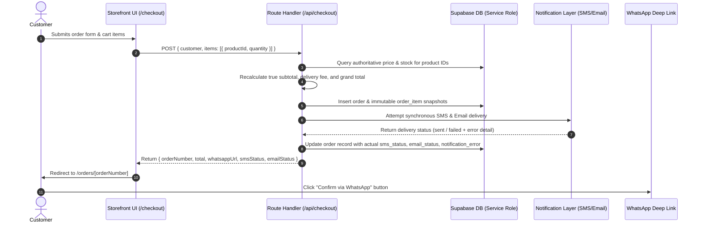

# Mart Gallery — Production Architecture & Implementation Plan

> **Note**: This document provides the complete, production-ready architectural blueprint and implementation plan for Mart Gallery.

---

## 1. Architecture

### Application Structure
- **Framework**: Next.js 14+ (App Router) with TypeScript and Tailwind CSS.
- **Dependencies Philosophy**: Minimalist, zero unnecessary third-party libraries. Native React Context for cart state; native Next.js Server Components and Server Actions / Route Handlers for server operations. No Zustand, SWR, or TanStack Query.
- **Directory Layout**:
  - `app/(storefront)`: Customer-facing routes (Homepage, Products catalog, Product details, Cart, Checkout, Order status).
  - `app/(admin)/admin`: Administrative control panel (Login, Dashboard Metrics, Products CRUD, Category manager, Order management).
  - `app/api`: Server-side API endpoints (`/api/checkout`, `/api/admin/*`, `/api/upload`).
  - `components/storefront`, `components/admin`, `components/common`, `components/map`: Modular, reusable UI components.
  - `lib/supabase`: SSR, Client, and Service-Role database access layers.
  - `lib/notifications`: SMS and Email gateway adapters with synchronous status tracking.
  - `lib/context`: Native React Context for cart state with `localStorage` synchronization.
  - `types/database.types.ts`: Strongly typed Supabase schema interfaces.

### Main Data Flow
1. **Public Catalog Browsing**: Server Components query Supabase directly with ISR / caching tags for instant static and dynamic page rendering.
2. **Cart Management**: Pure React Context (`CartContext`) synchronized with browser `localStorage` manages item IDs and quantities without third-party dependencies.
3. **Authoritative Checkout**:
   - Customer submits form data and cart items to the server endpoint `/api/checkout`.
   - Server fetches current prices and stock availability directly from Supabase via privileged query.
   - Server calculates true subtotal, delivery fee, and grand total.
   - An immutable order record and snapshot item records are written in a single database transaction.
   - SMS/Email notifications are attempted synchronously; actual delivery result (`sent` or `failed`) and any error trace are recorded directly into the order record.
   - Formatted WhatsApp invoice deep-link is generated.
   - Server returns verified order details and WhatsApp link to the client for redirection.

### Client vs. Server Responsibilities
- **Client**: UI presentation, React Context cart state, form validation, interactive map coordinate selection, responsive navigation.
- **Server**: Authoritative price calculation, stock verification, privileged database mutations, snapshot recording, admin identity verification, notification dispatch and status recording, secret key encapsulation.

### State Management
- **Storefront Cart**: Native React Context (`CartProvider`) paired with `localStorage`.
- **Server Data**: Next.js Server Components for data fetching; Server Actions / Route Handlers with `revalidatePath` for data mutations.

### Supabase Integration
- **Client Access**: `@supabase/ssr` with `createBrowserClient` using `NEXT_PUBLIC_SUPABASE_ANON_KEY` strictly for public read operations (catalog, categories).
- **Server Access**: `createServerClient` using secure HTTP-only cookies for admin session validation.
- **Privileged Backend**: `createClient` using `SUPABASE_SERVICE_ROLE_KEY` strictly inside Next.js Route Handlers for checkout transactions and privileged admin operations. The service-role key is never bundled or exposed to the client.

### Admin Architecture
- **Identity & Authorization**: Supabase Auth (Email + Password) coupled with an explicit `admin_users` table and PostgreSQL `is_admin()` security definer function.
- **Route Guard**: Next.js Middleware intercepts all `/admin/*` routes (excluding `/admin/login`), verifying the session cookie and ensuring the user exists in `admin_users`.
- **Initial Setup**: Admin user registered via Supabase Auth and added to `admin_users` table via migration/seed script.

### External Integrations
- **WhatsApp**: Direct click-to-chat URL (`https://wa.me/<PHONE>?text=...`) using pre-formatted, URL-encoded invoice markdown.
- **Map & Geolocation**: Leaflet / OpenStreetMap loaded via dynamic client-side rendering (zero third-party API keys or billing dependencies).
- **SMS Gateway**: Provider-agnostic adapter (`lib/notifications/sms.ts`) configured for Bangladesh gateways (Greenweb, BulkSMSBD, or Generic HTTP API) with local mock support.
- **Email Service**: Resend or SMTP (`lib/notifications/email.ts`) for transactional invoice notifications.

### Vercel Deployment Architecture
- Deployed on Vercel with automatic Edge caching for static pages.
- Node.js serverless functions execute Route Handlers and Server Actions.
- Environment variables and secrets configured in Vercel project settings.

---

## 2. Database Design

### Supabase PostgreSQL Schema

```sql
-- Enable UUID extension
CREATE EXTENSION IF NOT EXISTS "uuid-ossp";

-- 1. Admin Users Table (Explicit Role Enforcement)
CREATE TABLE admin_users (
    id UUID PRIMARY KEY REFERENCES auth.users(id) ON DELETE CASCADE,
    email TEXT NOT NULL UNIQUE,
    created_at TIMESTAMPTZ DEFAULT now() NOT NULL
);

-- Helper function to check if the active caller is an admin
CREATE OR REPLACE FUNCTION public.is_admin()
RETURNS BOOLEAN AS $$
BEGIN
    RETURN EXISTS (
        SELECT 1 FROM public.admin_users
        WHERE id = auth.uid()
    );
END;
$$ LANGUAGE plpgsql SECURITY DEFINER;

-- 2. Categories Table
CREATE TABLE categories (
    id UUID PRIMARY KEY DEFAULT gen_random_uuid(),
    name TEXT NOT NULL,
    slug TEXT UNIQUE NOT NULL,
    description TEXT,
    display_order INTEGER DEFAULT 0 NOT NULL,
    created_at TIMESTAMPTZ DEFAULT now() NOT NULL,
    updated_at TIMESTAMPTZ DEFAULT now() NOT NULL
);

-- 3. Products Table
CREATE TABLE products (
    id UUID PRIMARY KEY DEFAULT gen_random_uuid(),
    name TEXT NOT NULL,
    slug TEXT UNIQUE NOT NULL,
    price NUMERIC(12, 2) NOT NULL CHECK (price >= 0),
    compare_at_price NUMERIC(12, 2) CHECK (compare_at_price >= price),
    category_id UUID REFERENCES categories(id) ON DELETE SET NULL,
    image_url TEXT NOT NULL,
    gallery_images TEXT[] DEFAULT '{}'::TEXT[] NOT NULL,
    short_description TEXT NOT NULL,
    full_description TEXT NOT NULL,
    is_featured BOOLEAN DEFAULT false NOT NULL,
    is_hot BOOLEAN DEFAULT false NOT NULL,
    availability TEXT DEFAULT 'in_stock' NOT NULL CHECK (availability IN ('in_stock', 'out_of_stock', 'pre_order', 'discontinued')),
    created_at TIMESTAMPTZ DEFAULT now() NOT NULL,
    updated_at TIMESTAMPTZ DEFAULT now() NOT NULL
);

-- 4. Orders Table (Simplified Status Workflow & Notification Tracking)
CREATE TABLE orders (
    id UUID PRIMARY KEY DEFAULT gen_random_uuid(),
    order_number TEXT UNIQUE NOT NULL,
    customer_name TEXT NOT NULL,
    customer_phone TEXT NOT NULL,
    customer_email TEXT,
    delivery_address TEXT NOT NULL,
    latitude DOUBLE PRECISION,
    longitude DOUBLE PRECISION,
    location_note TEXT,
    subtotal NUMERIC(12, 2) NOT NULL,
    delivery_fee NUMERIC(12, 2) DEFAULT 0 NOT NULL,
    total NUMERIC(12, 2) NOT NULL,
    status TEXT DEFAULT 'pending' NOT NULL CHECK (status IN ('pending', 'confirmed', 'delivered', 'cancelled')),
    sms_status TEXT DEFAULT 'not_sent' NOT NULL CHECK (sms_status IN ('not_sent', 'sent', 'failed')),
    email_status TEXT DEFAULT 'not_sent' NOT NULL CHECK (email_status IN ('not_sent', 'sent', 'failed')),
    notification_error TEXT,
    admin_notes TEXT,
    created_at TIMESTAMPTZ DEFAULT now() NOT NULL,
    updated_at TIMESTAMPTZ DEFAULT now() NOT NULL
);

-- 5. Order Items Table (Immutable Snapshots)
CREATE TABLE order_items (
    id UUID PRIMARY KEY DEFAULT gen_random_uuid(),
    order_id UUID REFERENCES orders(id) ON DELETE CASCADE NOT NULL,
    product_id UUID REFERENCES products(id) ON DELETE SET NULL,
    product_name_snapshot TEXT NOT NULL,
    product_price_snapshot NUMERIC(12, 2) NOT NULL,
    product_image_snapshot TEXT,
    quantity INTEGER NOT NULL CHECK (quantity > 0),
    subtotal NUMERIC(12, 2) NOT NULL,
    created_at TIMESTAMPTZ DEFAULT now() NOT NULL
);

-- Indexes for high-efficiency querying
CREATE INDEX idx_products_slug ON products(slug);
CREATE INDEX idx_products_category ON products(category_id);
CREATE INDEX idx_products_featured ON products(is_featured) WHERE is_featured = true;
CREATE INDEX idx_products_hot ON products(is_hot) WHERE is_hot = true;
CREATE INDEX idx_products_availability ON products(availability);
CREATE INDEX idx_orders_order_number ON orders(order_number);
CREATE INDEX idx_orders_phone ON orders(customer_phone);
CREATE INDEX idx_orders_status ON orders(status);
CREATE INDEX idx_orders_created_at ON orders(created_at DESC);
CREATE INDEX idx_order_items_order_id ON order_items(order_id);
```

### Security & Row Level Security (RLS) Policies

```sql
-- Enable RLS on all tables
ALTER TABLE admin_users ENABLE ROW LEVEL SECURITY;
ALTER TABLE categories ENABLE ROW LEVEL SECURITY;
ALTER TABLE products ENABLE ROW LEVEL SECURITY;
ALTER TABLE orders ENABLE ROW LEVEL SECURITY;
ALTER TABLE order_items ENABLE ROW LEVEL SECURITY;

-- 1. Admin Users Policies
CREATE POLICY "Admins can view admin_users list" ON admin_users
    FOR SELECT TO authenticated USING (public.is_admin());

-- 2. Categories Policies
CREATE POLICY "Public categories are viewable by everyone" ON categories
    FOR SELECT USING (true);

CREATE POLICY "Admins can insert categories" ON categories
    FOR INSERT TO authenticated WITH CHECK (public.is_admin());

CREATE POLICY "Admins can update categories" ON categories
    FOR UPDATE TO authenticated USING (public.is_admin()) WITH CHECK (public.is_admin());

CREATE POLICY "Admins can delete categories" ON categories
    FOR DELETE TO authenticated USING (public.is_admin());

-- 3. Products Policies
CREATE POLICY "Public products are viewable by everyone" ON products
    FOR SELECT USING (true);

CREATE POLICY "Admins can insert products" ON products
    FOR INSERT TO authenticated WITH CHECK (public.is_admin());

CREATE POLICY "Admins can update products" ON products
    FOR UPDATE TO authenticated USING (public.is_admin()) WITH CHECK (public.is_admin());

CREATE POLICY "Admins can delete products" ON products
    FOR DELETE TO authenticated USING (public.is_admin());

-- 4. Orders Policies
-- Anonymous/direct client INSERT and SELECT are strictly disabled.
-- Customers place orders via the server-side /api/checkout endpoint using the service-role key.
-- Customers look up their order status via a secure server route requiring order number + phone verification.
CREATE POLICY "Admins can view all orders" ON orders
    FOR SELECT TO authenticated USING (public.is_admin());

CREATE POLICY "Admins can update orders" ON orders
    FOR UPDATE TO authenticated USING (public.is_admin()) WITH CHECK (public.is_admin());

CREATE POLICY "Admins can delete orders" ON orders
    FOR DELETE TO authenticated USING (public.is_admin());

-- 5. Order Items Policies
-- Direct public operations are disabled; managed strictly via server-side checkout or admin interface.
CREATE POLICY "Admins can view all order items" ON order_items
    FOR SELECT TO authenticated USING (public.is_admin());

CREATE POLICY "Admins can update order items" ON order_items
    FOR UPDATE TO authenticated USING (public.is_admin()) WITH CHECK (public.is_admin());

CREATE POLICY "Admins can delete order items" ON order_items
    FOR DELETE TO authenticated USING (public.is_admin());
```

### Storage Configuration
- **Bucket**: `product-images` (Public read for CDN performance).
- **Validation**: Restricted to MIME types `image/jpeg`, `image/png`, `image/webp` with a 5MB maximum file size.
- **Storage Policies**:
  - `SELECT`: Public access.
  - `INSERT`, `UPDATE`, `DELETE`: Restricted to authenticated admins where `public.is_admin() = true`.
- **Path Standard**: `products/{slug}-{timestamp}-{filename}`.

### Admin Authentication & Bootstrap
- Handled via Supabase Auth (Email + Password).
- Initial admin account:
  - Seeded in `auth.users` with the specified initial password (`ARIFmama22`) and linked directly to `public.admin_users`.
  - Password can be securely reset via the Supabase Dashboard or authenticated admin profile settings.
- Server validation performed via Next.js Middleware checking both the auth session and `admin_users` membership.

### Checkout Flow


### Location Solution
- **Map Library**: Leaflet + OpenStreetMap integrated via dynamic client component (`next/dynamic` with `ssr: false`).
- **Features**:
  - Manual text address entry.
  - Interactive map pin placement.
  - "Use My Current Location" button via `navigator.geolocation`.
  - Automatic reverse geocoding via OpenStreetMap Nominatim.
- **Data Stored**: `delivery_address`, `latitude`, `longitude`, `location_note`.

### Synchronous Notifications & Provider Abstraction
- **Execution**: Attempted synchronously within the server-side order lifecycle.
- **Accurate Status Recording**: If the SMS or email dispatch fails, the system records `failed` and stores the error message in `notification_error`. The order itself succeeds, and the API accurately reports the delivery status without masking failures.
- **Modular Provider Abstraction**:
  - SMS interface (`ISmsProvider`) implemented for Greenweb, BulkSMSBD, Generic HTTP POST, and a local console logger.
  - Email interface (`IEmailProvider`) implemented for Resend, SMTP, and a local console logger.
  - Structured so a dedicated background queue (e.g., Upstash / Redis) can be seamlessly slotted in later without rewriting business logic.

### Order Status Workflow
Simplified 3-stage progression with conditional cancellation:
$$\text{Pending} \longrightarrow \text{Confirmed} \longrightarrow \text{Delivered}$$
$$\downarrow \quad\quad\quad\quad\quad \downarrow$$
$$\text{Cancelled} \quad\quad\quad \text{Cancelled}$$

- **`pending`**: Order placed by customer; awaiting store verification.
- **`confirmed`**: Order reviewed and accepted by store staff.
- **`delivered`**: Order successfully handed over to customer.
- **`cancelled`**: Order cancelled by admin (from `pending` or `confirmed` status).

### Admin Control Panel
- **Dashboard**: Metrics summary (Total revenue, pending orders, total products, out-of-stock items).
- **Product Management**: Filterable product catalog, quick toggles (`is_featured`, `is_hot`, `availability`), create/edit forms with multi-image storage uploads.
- **Category Management**: Add, update, and sort categories.
- **Order Management**: Filter orders by status (`pending`, `confirmed`, `delivered`, `cancelled`), search by phone or order number, update order status, review notification delivery status (`sent` / `failed`), and manage admin notes.

### UI & Design System
- **Tone**: Clean, modern, trustworthy, premium retail experience.
- **Color Palette**:
  - Light surfaces: `#F8FAFC`, `#FFFFFF`.
  - Deep Navy / Near-Black: `#0F172A`, `#1E293B`.
  - Brand Warm Amber/Gold: `#D97706` / `#B45309`.
  - Subtle slate borders: `#E2E8F0`.
- **Strict Brand Rule**: Arif Ahmed's name will **NOT** appear in any customer-facing UI, metadata, or notification template.

---

## 3. Implementation Order

1. **Phase 1: Foundation & Tooling**
   - Initialize Next.js 14+ with TypeScript, Tailwind CSS, Lucide icons, and `@supabase/ssr`.
   - Configure global design tokens, fonts, and base layouts.
2. **Phase 2: Database Schema, Security & Storage**
   - Execute migration script with `admin_users` table, `is_admin()` function, RLS policies, and indexes.
   - Configure `product-images` storage bucket with admin-only write permissions.
3. **Phase 3: Core Data & Supabase Client Layer**
   - Implement Supabase clients (`client.ts`, `server.ts`, `admin.ts`).
   - Generate TypeScript interfaces in `types/database.types.ts`.
   - Setup Zod validation schemas.
4. **Phase 4: Storefront & Product Browsing**
   - Develop Header, Navigation, Footer, and Announcement Bar.
   - Build Homepage with Hero, Featured Products, Hot Deals, and Category showcases.
   - Build Products Catalog with filtering, search, and sorting.
   - Build Product Detail Page with image gallery and availability badges.
5. **Phase 5: Cart (React Context) & Location Selection**
   - Implement `CartContext` with `localStorage` synchronization.
   - Implement Leaflet / OpenStreetMap location picker with reverse geocoding.
6. **Phase 6: Checkout, Order Verification & WhatsApp Integration**
   - Build checkout page with client-side form validation.
   - Implement `/api/checkout` with server-side price verification and atomic order snapshot creation.
   - Implement WhatsApp invoice generator and order confirmation view (`/orders/[orderNumber]`).
7. **Phase 7: Admin Panel & Authentication**
   - Build admin login page and setup Supabase Auth middleware protection.
   - Build Admin Dashboard, Product CRUD, Category Manager, and Order Management table.
8. **Phase 8: Notifications Layer**
   - Implement SMS and Email delivery modules with synchronous status tracking.
   - Connect notification triggers to order placement and status transitions.
9. **Phase 9: Verification & Polish**
   - Run type-checking (`npx tsc --noEmit`) and production builds (`npm run build`).
   - Test end-to-end checkout, price tampering prevention, snapshot persistence, and admin controls.
10. **Phase 10: Vercel Deployment**
    - Deploy to Vercel and configure production environment variables.
    - Perform live post-deployment verification.

---

## 4. Supabase Setup Required From Me

1. **Create a Supabase Project**:
   - Go to [database.new](https://database.new) and create a project named `martgallery`.
   - Select the closest region (e.g., `Singapore`).
2. **Collect Project API Keys**:
   - In **Project Settings** -> **API**, copy:
     - **Project URL**
     - **`anon` `public` key**
     - **`service_role` `secret` key**
3. **Execute the Migration Script**:
   - In **SQL Editor**, paste and run the complete SQL script from `supabase/migrations/20260825_initial_schema.sql`.
4. **Create Storage Bucket**:
   - In **Storage**, create a public bucket named `product-images`.
5. **Create Initial Admin Account**:
   - In **Authentication** -> **Users**, create a new user with your admin email and password (`ARIFmama22`).
   - In **SQL Editor**, link the user as an admin:
     ```sql
     INSERT INTO public.admin_users (id, email)
     SELECT id, email FROM auth.users WHERE email = 'your-admin-email@example.com';
     ```

---

## 5. Environment Variables

### Public / Client-Safe Variables
```env
NEXT_PUBLIC_SUPABASE_URL=https://your-project-id.supabase.co
NEXT_PUBLIC_SUPABASE_ANON_KEY=your-anon-key-here
NEXT_PUBLIC_SITE_URL=https://martgallery.vercel.app
NEXT_PUBLIC_STORE_NAME=Mart Gallery
NEXT_PUBLIC_CURRENCY=BDT
NEXT_PUBLIC_WHATSAPP_PHONE=8801XXXXXXXXX
```

### Private / Server-Only Secrets
```env
SUPABASE_SERVICE_ROLE_KEY=your-service-role-key-here
SMS_PROVIDER=generic_http # Options: greenweb, bulksmsbd, generic_http, mock
SMS_API_KEY=your_sms_api_key_here
SMS_SENDER_ID=your_sender_id_here
SMS_API_URL=https://api.sms-provider.com/send
EMAIL_PROVIDER=resend # Options: resend, smtp, mock
RESEND_API_KEY=re_your_api_key_here
EMAIL_FROM="Mart Gallery <orders@martgallery.com>"
ADMIN_NOTIFICATION_EMAIL=admin@martgallery.com
```

---

## 6. Deployment Plan

1. **Repository Setup**: Push the project codebase to GitHub.
2. **Vercel Project Setup**: Import the repository into Vercel and select the Next.js framework preset.
3. **Environment Secrets**: Add all public and private environment variables in Vercel **Project Settings** -> **Environment Variables**.
4. **Build & Validation**: Execute the production build and verify serverless function execution.
5. **Post-Deployment Verification**: Verify catalog rendering, image serving, map picker, order placement with snapshot creation, and admin access.

---

## 7. Documentation Plan

The following reference documents will be maintained at the root:
- **`BUILD_GUIDE.md`**: Step-by-step development setup, migration execution, and deployment instructions.
- **`PROJECT_MAP.md`**: Directory structure, file responsibilities, and data flow map.

---

## 8. Implementation Risks / Decisions

| Item | Decision / Strategy | Risk & Mitigation |
| :--- | :--- | :--- |
| **Admin RLS Security** | `admin_users` table + `public.is_admin()` | Prevents unauthorized authenticated users from mutating catalog or reading orders; avoids broad `TO authenticated` policies. |
| **Order Creation Security** | Server-side only via Service Role | No direct public insert on `orders` or `order_items`; protects against price tampering and database spam. |
| **Notification Accuracy** | Synchronous delivery with status recording | Prevents false positives by recording actual `sent` or `failed` status and error logs directly on the order record. |
| **State Simplicity** | React Context + Next.js Server Components | Eliminates external state libraries (Zustand, SWR, TanStack Query), keeping bundle size and memory usage minimal. |
| **Status Progression** | `pending` $\rightarrow$ `confirmed` $\rightarrow$ `delivered` (or `cancelled`) | Clean, unambiguous business workflow tailored for retail operations. |
| **Historical Accuracy** | Snapshot columns in `order_items` | Retains exact price and product name at the time of purchase, insulating historical records from catalog changes. |
| **Owner Anonymity** | Strict brand-only customer UI | Ensures Arif Ahmed's name is completely excluded from storefront pages and notifications. |

---

*End of Revised Architecture & Implementation Plan. Awaiting confirmation to proceed.*
